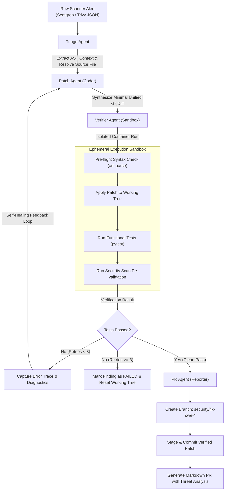

# Autonomous Agentic Patching & DevSecOps Remediation Bot

[](https://github.com/ravishkarathnayaka/Autonomous-Agentic-Patching-DevSecOps-Remediation-Bot/actions/workflows/ci.yml)
[](https://github.com/ravishkarathnayaka/Autonomous-Agentic-Patching-DevSecOps-Remediation-Bot/actions/workflows/security-scan.yml)
[](https://www.python.org/downloads/)
[](https://opensource.org/licenses/MIT)
[](https://ollama.ai)

> **Autonomous multi-agent DevSecOps bot that ingests SAST/SCA alerts, generates surgical security patches, validates regressions in ephemeral Docker sandboxes, and submits production-ready annotated Pull Requests.**

---

## 📌 Table of Contents
- [Live Web Portal & Vercel Deployment](#-live-web-portal--vercel-deployment)
- [Executive Overview](#-executive-overview)
- [Multi-Agent State Architecture](#-multi-agent-state-architecture)
- [Agent Engine Deep Dive](#-agent-engine-deep-dive)
- [Threat Model & Safety Controls](#-threat-model--safety-controls)
- [Project Directory Layout](#-project-directory-layout)
- [Getting Started ($0 Local Execution)](#-getting-started-0-local-execution)
  - [Prerequisites](#prerequisites)
  - [Option 1: Quickstart with Offline Mock LLM (Deterministic CI)](#option-1-quickstart-with-offline-mock-llm-deterministic-ci)
  - [Option 2: Local AI with Ollama (Qwen2.5-Coder / Llama 3)](#option-2-local-ai-with-ollama-qwen25-coder--llama-3)
  - [Option 3: Full Stack via Docker Compose](#option-3-full-stack-via-docker-compose)
- [Walkthrough: Remediating the Included `target_repo`](#-walkthrough-remediating-the-included-target_repo)
- [Sample Generated Pull Request](#-sample-generated-pull-request)
- [Automated Testing & CI/CD](#-automated-testing--cicd)
- [License](#-license)

---

## 🌐 Live Web Portal & Vercel Deployment

A rich, interactive web application is included in `web/` allowing anyone to test, simulate, and inspect the autonomous remediation agents live in their browser.

[](https://vercel.com/new/clone?repository-url=https%3A%2F%2Fgithub.com%2Fravishkarathnayaka%2FAutonomous-Agentic-Patching-DevSecOps-Remediation-Bot)

### Key Portal Capabilities:
- **Interactive Multi-Agent State Machine**: Real-time visual progress nodes for Triage, Patch, Verifier, and PR agents.
- **Scenario Presets**: Instantly trigger remediation against SQLi (CWE-89), Path Traversal (CWE-22), Command Injection (CWE-78), or Flask SCA (CVE-2023-30861).
- **Self-Healing Simulation**: Toggle the retry feedback loop to watch the Verifier detect an intentional defect, feed diagnostics back to the Patch Agent, and self-heal on attempt #2.
- **Unified Diff Viewer**: Colorized before/after code comparison with line change indicators and one-click `.patch` download.
- **Ephemeral Sandbox Console**: Emulated Docker container output with regression test results and capability lockdown indicators.
- **GitHub PR Modal**: One-click copy or download of full GitHub-ready pull request documentation.

### Run Web Portal Locally:
```bash
cd web
npm install
npm run dev
# Open http://localhost:3000 in your browser
```

### Deploy to Vercel in 60 Seconds:
1. Push this repository to GitHub (or use the one-click deploy button above).
2. Go to [vercel.com](https://vercel.com) and click **"Add New Project"**.
3. Import `Autonomous-Agentic-Patching-DevSecOps-Remediation-Bot`.
4. Vercel automatically detects the Vite framework and builds `web/` using the included `vercel.json`.
5. Your live URL is generated immediately! (e.g. `https://devsecops-bot.vercel.app`)

---

## 🚀 Executive Overview

Modern Application Security produces thousands of SAST and SCA findings. Traditional DevSecOps pipelines notify developers via tickets or alert dumps, introducing friction and remediation backlogs.

The **Autonomous Agentic Patching & DevSecOps Remediation Bot** closes this gap by transforming passive alert generation into **active, self-healing remediation**:

1. **Ingests Scanner Output**: Normalizes Semgrep (SAST) and Trivy (SCA) findings.
2. **Context Enrichment via AST**: Parses source code abstract syntax trees to isolate enclosing functions, classes, and scopes.
3. **Surgical Patch Synthesis**: Prompts local or hosted LLMs to synthesize minimal unified git diffs targeting only the root cause.
4. **Ephemeral Sandbox Verification**: Tests the generated patch inside an unprivileged Docker container with dropped capabilities and zero network egress, verifying that regression test suites (`pytest`) pass and vulnerabilities are eliminated.
5. **Self-Healing Feedback Loop**: If verification fails due to syntax errors or broken tests, the failure trace is fed back into the Patch Agent to iteratively fix the issue (up to 3 retries).
6. **Automated PR & Git Branching**: Establishes a dedicated security branch, creates atomic commits, and renders a GitHub-ready markdown Pull Request with threat mitigation analysis.

---

## 📐 Multi-Agent State Architecture

The remediation pipeline is implemented as a finite-state machine orchestrated by four specialized agent nodes with a closed feedback loop:



---

## 🤖 Agent Engine Deep Dive

| Agent | Module | Primary Responsibility | Key Techniques |
| :--- | :--- | :--- | :--- |
| **Triage Agent** | `agent_engine/agents/triage_agent.py` | Finding normalization, file resolution, AST extraction | Python `ast.NodeVisitor`, path resolution, scope isolation |
| **Patch Agent** | `agent_engine/agents/patch_agent.py` | Security diff synthesis and prompt orchestration | Unified diff parsing, CWE mitigation patterns, error-conditioned prompts |
| **Verifier Agent** | `agent_engine/agents/verifier_agent.py` | Regression testing and security verification in sandbox | Docker Python SDK, resource limits, capability dropping, AST pre-flight checks |
| **PR Agent** | `agent_engine/agents/pr_agent.py` | Branch creation, atomic commits, PR documentation | Git automation, CVSS threat modeling, markdown report synthesis |

---

## 🛡️ Threat Model & Safety Controls

Running AI-generated code against source repositories carries inherent risks. The bot incorporates defense-in-depth security controls:

### 1. Ephemeral Sandbox Execution Isolation
All tests and code execution are executed inside ephemeral Docker containers (`docker/sandbox.Dockerfile`) configured with:
- **`network_disabled=True`**: Zero outbound or inbound socket connections during test runs, preventing data exfiltration or reverse shells.
- **`cap_drop=["ALL"]`**: Eliminates Linux capabilities (`CAP_SYS_ADMIN`, `CAP_NET_RAW`, etc.).
- **`mem_limit="512m"` & `cpu_quota=50000`**: Defends against algorithmic denial-of-service (DoS) or CPU exhaustion loops.
- **Non-root Execution**: Runs under an unprivileged `sandboxuser` (UID 1000).
- **Auto-Cleanup**: Containers are strictly ephemeral (`remove=True`) and terminated after completion.

### 2. Guardrails Against Infinite Loops
- Strict maximum retry cap (`max_retries = 3`). If the Patch Agent cannot produce a passing patch within 3 attempts, the finding is marked as `FAILED`, working trees are reset (`git reset --hard`), and an alert is logged.

### 3. Non-Destructive Git Operations
- Patches are validated on temporary working copies or isolated branches (`security/fix-<cwe>-<timestamp>`).
- If tests fail, the working tree is reverted to a clean state via `git_tools.reset_working_tree()`.

---

## 📂 Project Directory Layout

```
Autonomous-Agentic-Patching-DevSecOps-Remediation-Bot/
├── .github/
│   └── workflows/
│       ├── ci.yml                 # Linting (flake8), typing (mypy), and pytest suite
│       └── security-scan.yml      # Trivy filesystem and Gitleaks secret scanners
├── docker/
│   ├── docker-compose.yml         # Local stack: Ollama LLM, Redis, Bot Runner
│   ├── sandbox.Dockerfile         # Ephemeral runner container for test isolation
│   └── .env.example               # Environment variables template
├── agent_engine/
│   ├── __init__.py
│   ├── state.py                   # Pydantic v2 data models for remediation state
│   ├── graph.py                   # Multi-agent state machine orchestrator
│   ├── agents/
│   │   ├── triage_agent.py        # Finding ingestion & AST context enrichment
│   │   ├── patch_agent.py         # LLM prompt orchestration & diff extraction
│   │   ├── verifier_agent.py      # Sandbox regression test runner & retry router
│   │   └── pr_agent.py            # Git branch creation & markdown PR generator
│   ├── tools/
│   │   ├── report_parsers.py      # Semgrep SAST & Trivy SCA JSON parsers
│   │   ├── ast_parser.py          # Surrounding function/class AST extractor
│   │   ├── git_tools.py           # Branching, patch staging, and commit engine
│   │   └── sandbox_executor.py    # Docker SDK isolated executor with local fallback
│   └── llm/
│       ├── client.py              # Unified client: Mock, Ollama, and OpenAI
│       └── mock_provider.py       # Deterministic mock LLM provider for tests & CI
├── target_repo/                   # Sample vulnerable workspace
│   ├── app.py                     # Vulnerable Flask app (SQLi, Path Traversal, Cmd Injection)
│   ├── test_app.py                # Functional test suite that must continue passing
│   ├── safe_files/welcome.txt     # Safe fixture file for path traversal validation
│   └── requirements.txt           # Intentionally pinned vulnerable dependencies
├── cli/
│   ├── __init__.py
│   └── main.py                    # Production CLI tool with rich formatted logs
├── tests/
│   ├── fixtures/
│   │   ├── semgrep_findings.json  # Real-world Semgrep SAST test fixture
│   │   └── trivy_findings.json    # Real-world Trivy SCA test fixture
│   ├── test_report_parsers.py     # Parser unit tests
│   ├── test_ast_parser.py         # AST context extraction unit tests
│   ├── test_patch_agent.py        # Patch agent prompting & diff tests
│   └── test_end_to_end_flow.py    # Full multi-agent integration & retry tests
├── pyproject.toml                 # Package configuration, mypy & pytest settings
├── requirements.txt               # Project runtime and test dependencies
└── README.md                      # Architecture documentation & quickstart
```

---

## ⚡ Getting Started ($0 Local Execution)

### Prerequisites
- Python 3.11+
- Git
- (Optional) Docker or Docker Desktop for containerized sandbox isolation
- (Optional) [Ollama](https://ollama.ai) for free local LLM execution

Install core dependencies:
```bash
pip install -r requirements.txt
```

---

### Option 1: Quickstart with Offline Mock LLM (Deterministic CI)

Run the bot against the provided Semgrep scan fixture using the deterministic Mock LLM provider. Zero setup, zero API cost:

```bash
python -m cli.main --report tests/fixtures/semgrep_findings.json --target target_repo/ --provider mock --output-pr PR_OUTPUT.md
```

To test the **self-healing retry feedback loop**, use the `--simulate-failure` flag:
```bash
python -m cli.main --report tests/fixtures/semgrep_findings.json --target target_repo/ --provider mock --simulate-failure
```

---

### Option 2: Local AI with Ollama (Qwen2.5-Coder / Llama 3)

Run completely locally on your hardware for $0 with an open-source coding model:

1. Download and start [Ollama](https://ollama.ai):
```bash
ollama run qwen2.5-coder:7b
```

2. Run the remediation bot:
```bash
python -m cli.main \
  --report tests/fixtures/semgrep_findings.json \
  --target target_repo/ \
  --provider ollama \
  --model qwen2.5-coder:7b \
  --base-url http://localhost:11434 \
  --output-pr PR_OUTPUT.md
```

---

### Option 3: Full Stack via Docker Compose

Launch Ollama, Redis, and the Sandbox Runner in a single command:

```bash
cd docker
cp .env.example .env
docker compose up -d
```

---

## 🧪 Walkthrough: Remediating the Included `target_repo`

The repository includes a sample vulnerable application in `target_repo/` with three intentional security flaws:
- **CWE-89**: SQL Injection in `/items` (`app.py:28`)
- **CWE-22**: Path Traversal in `/files` (`app.py:42`)
- **CWE-78**: Command Injection in `/ping` (`app.py:58`)

### Step 1: Generate a Semgrep Scan
```bash
semgrep scan --config=auto --json target_repo/ > semgrep_report.json
```

### Step 2: Trigger Autonomous Remediation
```bash
python -m cli.main --report semgrep_report.json --target target_repo/ --output-pr PR_OUTPUT.md
```

### Step 3: Observe Real-time Agent Execution
```text
========================================================================
   AUTONOMOUS AGENTIC PATCHING & DEVSECOPS REMEDIATION BOT
      Triage -> Patch Agent -> Sandbox Verifier -> PR Agent
========================================================================

[*] Target Repository: /path/to/target_repo
[*] Ingesting Security Scan Report: semgrep_report.json
[*] LLM Engine: Provider=MOCK Model=default
[*] Execution Sandbox Mode: Local Subprocess (Process-isolated)

============================================================
[1/3] REMEDIATING: SQL Injection in /items endpoint [HIGH]
     Rule: rules.python.security.sqlite_sql_injection | CWE: CWE-89
     Location: app.py:28
  -> Remediation VERIFIED and PR Generated!
     Branch: security/fix-cwe-89-20261002-221200
     Commit: 4a3e7b89f012

======================================================================
                    REMEDIATION EXECUTION SUMMARY
======================================================================
Total Processed: 3 | Succeeded: 3 | Failed: 0
----------------------------------------------------------------------
[PR_READY]           CWE-89          Retries: 0 | Branch: security/fix-cwe-89-20261002-221200
[PR_READY]           CWE-22          Retries: 0 | Branch: security/fix-cwe-22-20261002-221201
[PR_READY]           CWE-78          Retries: 0 | Branch: security/fix-cwe-78-20261002-221202

[+] Wrote Pull Request markdown description to: PR_OUTPUT.md
```

---

## 📝 Sample Generated Pull Request

Below is an example of the production-ready markdown description automatically generated in `PR_OUTPUT.md`:

````markdown
## 🛡️ Autonomous Security Remediation Pull Request

### 1. Executive Summary
- **Vulnerability Title**: SQL Injection in /items endpoint
- **Scanner**: `SEMGREP` (SAST)
- **Rule / Advisory ID**: `rules.python.security.sqlite_sql_injection`
- **Severity**: **`HIGH`**
- **CWE Identifier(s)**: `CWE-89`
- **CVSS Score**: `9.8`
- **Target File**: `app.py` (Lines 28 - 29)

---

### 2. Threat Analysis & Remediation Rationale
Replaced untrusted string interpolation with parameterized SQL query using standard SQLite placeholder `?`.
This prevents SQL injection attacks (CWE-89) by separating SQL query code from user-supplied data arguments.

#### Security Controls Applied:
- Surgical code modification targeting only the vulnerable execution flow.
- Enforced defense-in-depth principles (parameterized queries).
- Preserved existing application semantics and interface contracts.

---

### 3. Surgical Patch Diff
```diff
--- a/target_repo/app.py
+++ b/target_repo/app.py
@@ -28,3 +28,3 @@
-    query = f"SELECT * FROM items WHERE name = '{name}'"
-    cursor.execute(query)
+    query = "SELECT * FROM items WHERE name = ?"
+    cursor.execute(query, (name,))
```

---

### 4. Sandbox Verification Evidence
> **Verification Status**: ✅ **PASSED** (Executed inside Ephemeral Container Sandbox)
> **Total Attempts / Retries**: `1` / `3`
> **Execution Duration**: `0.88s`

```text
============================= test session starts =============================
platform linux -- Python 3.11.8, pytest-8.1.1
collected 3 items

test_app.py::test_search_valid PASSED                                    [ 33%]
test_app.py::test_file_view_valid PASSED                                 [ 66%]
test_app.py::test_ping_valid PASSED                                      [100%]

============================== 3 passed in 0.88s ==============================
```

---

### 5. DevSecOps Sign-off & Verification Checklist
- [x] Ephemeral sandbox execution verified without host compromise.
- [x] Zero regression in existing unit test suites (`pytest`).
- [x] Clean syntax and AST structure verified.
- [ ] Peer code review and security sign-off before merge.
````

---

## 🧪 Automated Testing & CI/CD

Run all unit tests, AST parsers, report ingestion, and end-to-end integration flows:

```bash
# Run complete test suite
pytest tests/ target_repo/test_app.py -v

# Run with test coverage
pytest tests/ target_repo/test_app.py -v --cov=agent_engine --cov=cli

# Run strict type checks
mypy agent_engine cli

# Run code style and linting
flake8 agent_engine cli tests --max-line-length=130 --extend-ignore=E203,W503
```

All four commands execute in the repository's GitHub Actions CI pipeline on every push and pull request.

---

## 📄 License

This project is licensed under the MIT License - see the [LICENSE](LICENSE) file for details.
